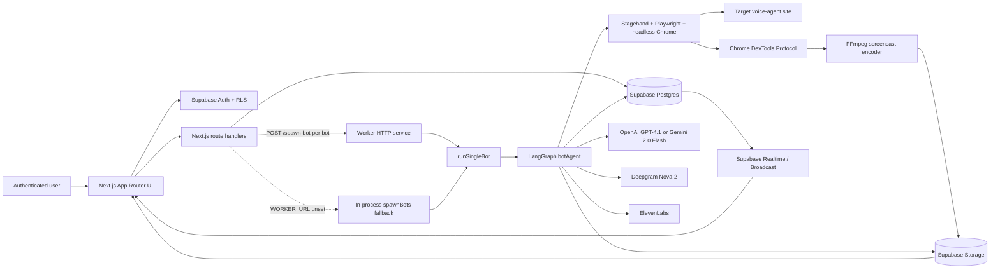

# tracebox

tracebox is a Next.js control plane for running batches of browser-based voice-agent tests, using a LangGraph state machine, headless Chrome, WebRTC audio handling, and persisted execution traces to drive and inspect each bot session.

The application lets an authenticated user define a target URL, bot instructions, session limits, and an LLM provider, then launch a workspace run containing 1–100 independent bots. Each bot navigates the target site, participates in a voice session, records the browser and conversation, and writes its transcript, screenshots, logs, and node timings to Supabase for live monitoring and post-run inspection.

**Tharun Pranav** · [Email](mailto:sv.tharunpranav@gmail.com) · [GitHub](https://github.com/thrns) · [LinkedIn](https://www.linkedin.com/in/thrn) · [X](https://x.com/tharunpranav_07)

## Key Features

- **Graph-based browser agent** — LangGraph models setup and session execution as explicit nodes: navigation, setup, listening, transcription, reasoning, browser action, speech, and finalization.
- **Multimodal browser control** — Stagehand drives a local Playwright/Chromium instance; screenshots are passed inline to the selected reasoning model so the agent can recover from UI states such as forms, multiple-choice questions, or code editors.
- **Voice-session loop** — Remote WebRTC audio is captured with browser-side VAD, transcribed through Deepgram, converted into an LLM decision, synthesized with ElevenLabs, and injected back into the browser by replacing the active outbound audio track.
- **Per-bot execution isolation** — The production deployment fans out one HTTP request per bot to a worker service intended to run one Chrome instance per Cloud Run instance. Local execution also supports an in-process fallback and a legacy all-bots worker mode.
- **Realtime observability** — Supabase Postgres Changes update bot and workspace status in the UI; Supabase Broadcast carries live transcript entries and sampled CDP screencast frames to the live viewer.
- **Session evidence** — Each run can persist WebM/audio recordings, screenshots, structured transcript entries, per-node timing data, and server logs. The workspace UI exposes the recording, transcript, screenshots, trace, and logs for a bot.

## Architecture



The system has two runtime planes:

1. **Control plane** — The Next.js application handles Supabase-authenticated pages and route handlers. It creates workspaces, verifies ownership, creates bot rows for a run, starts/stops workspaces, and reads persisted results.
2. **Execution plane** — `worker/index.ts` exposes a small HTTP service. `/spawn-bot` acknowledges a request immediately and runs the bot in the background through `runSingleBot`. The worker and the in-process fallback both use the same LangGraph agent implementation.

Supabase is the shared coordination layer. Postgres stores workspaces, bots, transcripts, traces, and server logs; Storage stores recordings and screenshots; Auth provides the session used by the UI; and Realtime provides status changes and live bot channels.

## How It Works

### 1. Configure and launch a workspace

The workspace form collects a target URL, bot count, maximum session duration, provider (openai or gemini), and text instructions. Instructions can be written in the UI or loaded from a `.md`/`.txt` file; the file contents are stored in the `workspaces.instructions` column.

When the user clicks **Run Test**, [`POST /api/workspaces/[id]/run`](src/app/api/workspaces/[id]/run/route.ts) verifies ownership, calculates the next `run_number` for the workspace’s bot rows, creates one queued bot row per configured bot, and marks the workspace as running. With `WORKER_URL` configured, it dispatches one request per bot to the worker. Without it, the route imports `spawnBots()` and runs the bots in-process.

### 2. Execute the agent graph

[`botAgent`](src/lib/langgraph/bot-agent.ts) runs this state machine:

```text
navigate
   └─> setup ──┐
               └─> listen → transcribe → reason → act ──┐
                                                        ├─> speak → listen
                                                        └─> listen
                         any terminal/error condition ──> finalize
```

The navigation node launches headless Chrome, grants media permissions, installs the WebRTC/audio hooks, starts a CDP screencast, opens the target URL, and captures an initial screenshot. The setup node then lets the LLM perform one navigation or physical browser action per turn until the target session is ready.

During the active session:

1. `listen` captures remote WebRTC audio with silence detection and checks for user-requested workspace stops or the session deadline.
2. `transcribe` sends non-empty WebM audio to Deepgram and appends/broadcasts the resulting system utterance.
3. `reason` sends instructions, conversation history, action history, counters, and the latest screenshot to OpenAI or Gemini. The response is parsed as a structured decision containing speech, one browser action, an optional screenshot request, and an end flag.
4. `act` executes the browser action through Stagehand and captures/uploads a screenshot after actions or explicit screenshot requests.
5. `speak` generates 16 kHz PCM speech with ElevenLabs and injects it into the page’s active WebRTC senders, then records the bot utterance and broadcasts it.

### 3. Finalize and persist evidence

`finalize` stops browser-side audio recording and the CDP screencast, muxes audio and video with FFmpeg when both are available, and falls back to screen-only or audio-only upload when necessary. It then writes transcript rows, the JSON transcript, screenshot URLs, node timings, server logs, recording metadata, and final status to Supabase. When all bots in a workspace are complete or errored, the workspace is marked `completed` or `failed`.

## Technical Highlights

### Explicit orchestration and traces

The agent is a compiled LangGraph `StateGraph` with conditional edges for setup completion, session termination, browser actions, and speech. A timing wrapper records the duration of every graph node in `langgraph_trace`, which the bot detail panel renders as an execution trace. The state also carries the conversation, browser handles, recording handles, screenshot buffers, action history, and recovery counters.

### Browser-native audio capture and injection

The worker installs an initialization script before page navigation. It proxies `RTCPeerConnection` to retain remote audio tracks and active senders, captures the original microphone track, and prepares a mixer for the bot’s own TTS. TTS PCM is converted in the page to an `AudioBuffer` and `MediaStreamTrack`; `replaceTrack()` swaps it into every active audio sender and restores the original mic track after playback.

### Screenshot-aware reasoning without remote image fetches

Screenshots are uploaded to Supabase for the UI, but the latest raw PNG buffer is also held in LangGraph state and encoded as an inline `data:image/png;base64,...` URL for the LLM call. This keeps model reasoning independent of Storage URL fetches. After three bot turns without a system response, the reason node captures a fresh screenshot before asking the LLM to recover through a page interaction.

### Distributed fan-out with a local fallback

The production path sends one `/spawn-bot` request per bot to the worker and returns from the worker HTTP handler before the long-running browser session finishes. `deploy.sh` configures the worker with Cloud Run concurrency `1`, so each instance is intended to own one Chrome session; the frontend and worker can therefore scale independently. For local development, the same agent can run inside the Next.js process when `WORKER_URL` is unset, or through the worker’s `/spawn` all-bots endpoint.

### Live frames and transcripts

Chrome’s `Page.screencastFrame` events are acknowledged and piped to FFmpeg at 10 fps for the final WebM. Every tenth frame is also sent through a bot-specific Supabase Broadcast channel for the live viewer, which displays an approximately 1 fps screen feed alongside broadcast bot/system transcript entries.

## Tech Stack

| Area | Technologies |
| --- | --- |
| Web application | Next.js 14 App Router, React 18, TypeScript, Tailwind CSS |
| UI | Base UI, Radix UI, shadcn configuration, Lucide, Recharts |
| Agent orchestration | LangGraph, LangChain Google GenAI integration |
| Browser automation | Browserbase Stagehand, Playwright, Chromium, Chrome DevTools Protocol |
| LLMs | OpenAI GPT-4.1 for reasoning, Gemini 2.0 Flash as an alternative reasoning provider, Stagehand configured with OpenAI GPT-4o-mini |
| Voice | Deepgram Nova-2 speech-to-text, ElevenLabs `eleven_turbo_v2_5` text-to-speech, WebRTC/Web Audio APIs |
| Persistence and realtime | Supabase Postgres, Auth, Storage, Postgres Changes, Realtime Broadcast |
| Media and infrastructure | FFmpeg, Docker, Docker Compose, Google Cloud Run, Google Cloud Build |

## Project Structure

```text
.
├── src/app/                         # Next.js pages, middleware, and API route handlers
│   ├── (app)/                       # Authenticated dashboard, analytics, and workspace pages
│   └── api/                         # Workspace, bot, and worker-facing endpoints
├── src/components/                  # Auth, layout, workspace, chart, and UI components
├── src/hooks/                       # Supabase-backed workspace and realtime bot hooks
├── src/lib/
│   ├── langgraph/                   # BotState, graph definition, and graph nodes
│   ├── stagehand/                   # Browser creation, WebRTC capture, and TTS injection
│   ├── recording/                   # Audio capture, CDP screencast, FFmpeg muxing
│   ├── deepgram/                    # Speech-to-text client
│   ├── elevenlabs/                  # Text-to-speech client
│   ├── llm/                         # OpenAI/Gemini structured decisions
│   ├── logging/                     # Per-bot server log collection
│   └── supabase/                    # Browser, server, admin, and realtime clients
├── worker/                          # HTTP worker and single-bot/all-bots runners
├── supabase/migrations/              # Schema, RLS, Storage, Realtime, and run-history migrations
├── Dockerfile                        # Combined image; starts Next.js and can co-locate the worker
├── worker/Dockerfile                 # Worker image with Chromium and FFmpeg
├── docker-compose.yml                # Frontend/worker local container topology
├── deploy.sh                         # Two-service Cloud Run deployment script
└── cloudbuild.yaml                   # Cloud Build configuration for the combined image
```

## Getting Started

### Prerequisites

- Node.js 20 or a compatible current Node.js runtime
- npm (the repository includes `package-lock.json`)
- A Supabase project with the migrations in `supabase/migrations/` applied in numeric order
- API access to the selected LLM provider, Deepgram, and ElevenLabs
- Playwright’s managed Chromium and FFmpeg available locally, or Docker for the provided images

### Installation

```bash
npm ci
npx playwright install chromium
```

Install FFmpeg separately when running outside Docker (for example, `brew install ffmpeg` on macOS).

Apply the SQL files in `supabase/migrations/` in order (`001` through `008`) to the Supabase project. The migrations create the application tables, row-level security policies, Realtime publication, and `recordings`, `instructions`, and `screenshots` Storage buckets.

### Environment Variables

The repository does not include a `.env.example`; create a local `.env` and keep it out of version control. Use placeholder values for local configuration:

| Variable | Required | Purpose |
| --- | --- | --- |
| `NEXT_PUBLIC_SUPABASE_URL` | Yes | Supabase project URL used by the browser, server, and worker |
| `NEXT_PUBLIC_SUPABASE_ANON_KEY` | Yes | Supabase browser/server client key; also required at Next.js build time |
| `SUPABASE_SERVICE_ROLE_KEY` | Yes | Server/worker-only Supabase admin access for bot execution and Storage writes |
| `OPENAI_API_KEY` | Yes | OpenAI reasoning and Stagehand’s configured model |
| `GEMINI_API_KEY` | If using Gemini | Gemini reasoning provider |
| `DEEPGRAM_API_KEY` | Yes | Deepgram Nova-2 transcription |
| `ELEVENLABS_API_KEY` | Yes | ElevenLabs speech generation |
| `ELEVENLABS_VOICE_ID` | No | ElevenLabs voice; the code falls back to a default voice ID |
| `WORKER_API_KEY` | Recommended | Shared header key for worker `/spawn*` requests and the completion webhook |
| `WORKER_URL` | Optional | Worker base URL; omit it to use the in-process `spawnBots` fallback |
| `WORKER_PORT` | Optional | Local worker port; defaults to `3001` |
| `BOT_LAUNCH_STAGGER_MS` | Optional | Delay between browser launches in the all-bots local worker mode; defaults to `4000` |
| `CHROME_EXECUTABLE_PATH` | Optional | Explicit Chromium executable path when Playwright’s managed path is not suitable |

For split local development, set `WORKER_URL=http://127.0.0.1:3001`. If `WORKER_URL` is omitted, the Next.js run route does not call the standalone worker.

### Running Locally

Run the Next.js app and worker together:

```bash
npm run dev:all
```

Then open [http://localhost:3000](http://localhost:3000), sign in with a Supabase user, create a workspace, and run a test. The worker health endpoint is:

```bash
curl http://localhost:3001/health
```

For a single-process development run, omit `WORKER_URL` and start only Next.js:

```bash
npm run dev
```

In that mode, `POST /api/workspaces/:id/run` imports `spawnBots()` and runs the queued bots in the Next.js process.

### Docker

The repository includes separate frontend and worker images. The worker image installs Playwright’s Chromium dependencies and FFmpeg; the root image can start Next.js with a co-located worker or use an external `WORKER_URL`.

```bash
# Export these two values before building; NEXT_PUBLIC_* values are inlined by Next.js.
docker compose build \
  --build-arg NEXT_PUBLIC_SUPABASE_URL="$NEXT_PUBLIC_SUPABASE_URL" \
  --build-arg NEXT_PUBLIC_SUPABASE_ANON_KEY="$NEXT_PUBLIC_SUPABASE_ANON_KEY"
docker compose up
```

The checked-in Compose file currently maps the frontend as `3000:3000`, while `start.sh` defaults the container’s Next.js port to `8080`. Adjust the mapping to `3000:8080` before opening the UI locally.

## Usage

The primary interaction is through the authenticated web UI:

1. Sign in at `/login`.
2. Create a workspace with a target URL, bot count, maximum duration, provider, and instructions.
3. Open the workspace and click **Run Test**.
4. Monitor bot status and run history through Supabase Realtime updates.
5. Open a bot to inspect live transcript/screen activity or completed recordings, screenshots, traces, and server logs.
6. Use **Stop** to mark the workspace and all non-terminal bots as stopped.

The worker also exposes internal HTTP endpoints:

| Method | Path | Purpose |
| --- | --- | --- |
| `GET` | `/health` | Worker health check; does not require the API key |
| `POST` | `/spawn-bot` | Start one bot asynchronously; requires `x-api-key` when `WORKER_API_KEY` is set |
| `POST` | `/spawn` | Legacy local mode that starts all queued bots for a workspace |

Example worker request:

```bash
curl -X POST http://localhost:3001/spawn-bot \\
  -H 'Content-Type: application/json' \\
  -H 'x-api-key: <WORKER_API_KEY>' \\
  -d '{"botId":"<BOT_UUID>","workspaceId":"<WORKSPACE_UUID>"}'
```

In normal use, the UI’s run route creates the bot rows and dispatches these requests; calling the worker directly assumes the IDs already exist in Supabase.

## Testing and Verification

No automated test files or test-runner script are present in the repository. The available project-level verification command is:

```bash
npm run build
```

The production build currently compiles the Next.js app, runs the TypeScript validity check, and generates the application routes. `npm run lint` is declared in `package.json`, but no ESLint configuration is committed, so Next.js prompts for interactive configuration instead of running a non-interactive lint pass.

## Design Decisions

### Separate worker service with one bot per instance

**Decision →** Dispatch one `/spawn-bot` request per bot and configure the Cloud Run worker with concurrency `1`.

**Reason →** A bot owns a headless Chrome/WebRTC session and native FFmpeg process; isolating those resources keeps the frontend request path separate from long-running browser work and lets Cloud Run place bot runs on separate instances.

**Trade-off →** The deployment needs two services, shared configuration, and a service-to-service authentication key. The repository keeps a local in-process fallback to reduce development friction.

### LangGraph for the agent lifecycle

**Decision →** Represent setup, audio turns, browser actions, speech, and cleanup as a conditional `StateGraph`.

**Reason →** The graph makes terminal conditions and the active-session loop explicit, while the shared state provides a single place for conversation history, actions, handles, recovery counters, and traces.

**Trade-off →** Browser and media resources must be carried through state and cleaned up correctly on every terminal path.

### Supabase as database, storage, auth, and realtime layer

**Decision →** Use one Supabase project for user sessions, RLS-protected application data, Storage artifacts, Postgres Changes, and Broadcast channels.

**Reason →** The UI can observe bot state without polling, while workers on different instances share the same workspace and bot records.

**Trade-off →** The worker needs service-role credentials for writes, and the migration currently makes recordings and screenshots publicly readable in Storage.

### Browser-side WebRTC track replacement for TTS

**Decision →** Inject generated PCM by creating a browser `MediaStreamTrack` and calling `RTCRtpSender.replaceTrack()` rather than restarting Chrome for each utterance.

**Reason →** The browser session and peer connections remain alive across turns, which preserves the target site’s session state.

**Trade-off →** The approach depends on initialization-time browser hooks and headless Chromium media behavior; the implementation includes fake-media flags, permission grants, and best-effort fallbacks.

## Reliability and Failure Handling

The implementation uses concrete termination and fallback paths rather than relying on an unbounded agent loop:

- Every bot checks the workspace status and its wall-clock `max_session_duration` during listening, setup, and reasoning.
- Setup is capped at 50 turns; sessions with no system audio response are stopped after 20 turns; three consecutive bot utterances without a response trigger screenshot-based stuck recovery.
- Browser actions, screenshot uploads, live broadcasts, CDP logging, audio capture, and recording cleanup are isolated with non-fatal handling where the session can continue.
- If audio/video muxing fails, finalization attempts screen-only upload; if no screen is available, it attempts audio-only upload.
- Worker failures update the bot to `error`; successful finalization persists the trace and logs; workspace completion is derived from all bot statuses.
- The stop endpoint marks the workspace and all non-terminal bots as `stopped`. The agent also checks the workspace row before each listen turn.

## Security Boundaries

- Next.js middleware refreshes Supabase sessions and redirects unauthenticated users away from application routes.
- API handlers verify the authenticated user and workspace ownership before reading or mutating workspace data; the bot endpoint verifies ownership through its parent workspace.
- Supabase RLS policies scope browser-visible workspaces, bots, transcripts, and workspace deletion to the authenticated user. The worker uses the service-role client for server-side bot updates and Storage writes.
- Worker endpoints and the completion webhook support an `x-api-key` shared secret. Configure `WORKER_API_KEY` in both services and do not expose the service-role key or provider keys to the browser.
