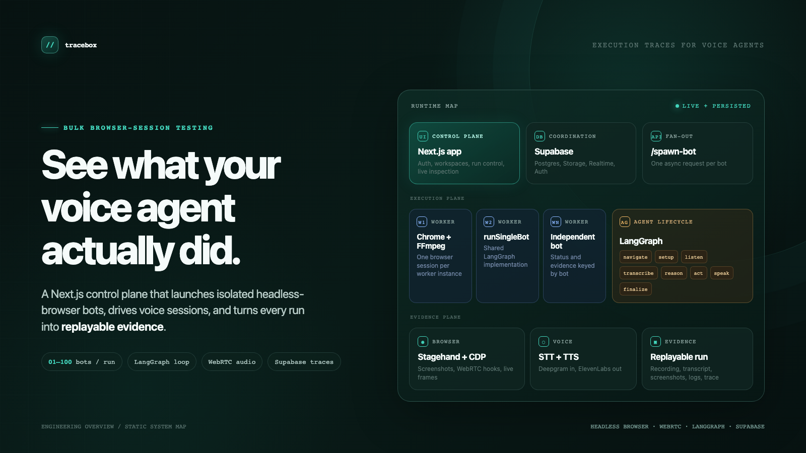
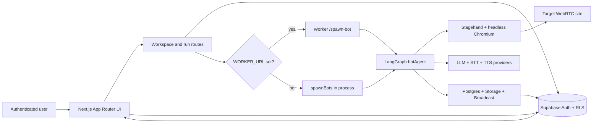
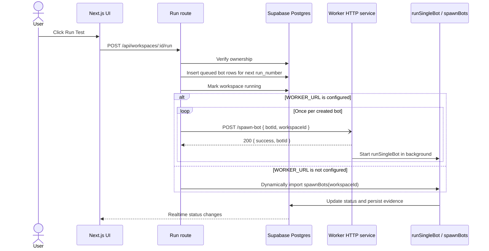
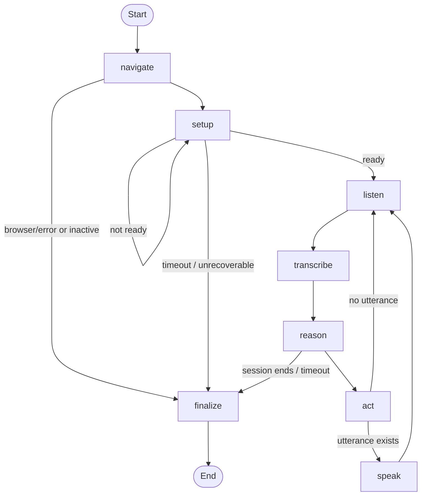
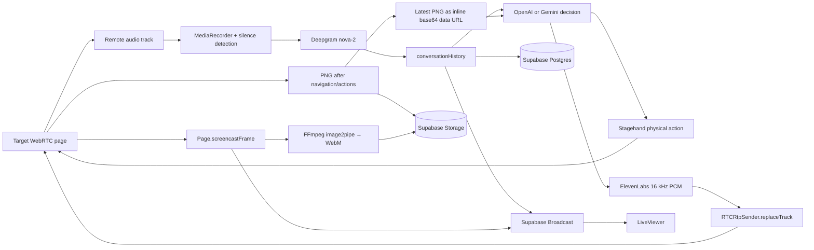

# tracebox

Bulk-test browser-based voice agents with isolated headless Chrome sessions, a LangGraph execution loop, and persisted run evidence.

tracebox is a Next.js control plane for configuring a target URL, bot instructions, bot count, session duration, and reasoning provider. A run creates one queued bot record per configured bot, executes each session through a shared LangGraph agent, and exposes live status plus post-run evidence in the authenticated UI.

## At a glance

| Concern | What the repository implements |
| --- | --- |
| Run model | A workspace can be run repeatedly; bots are grouped by `run_number`. |
| Batch size | `1–100` bots per run, enforced by the `workspaces.bot_count` schema constraint and UI input. |
| Browser session | Local headless Chromium launched through Stagehand and Playwright, with Chrome DevTools Protocol access. |
| Voice loop | Browser WebRTC audio → VAD capture → Deepgram transcription → OpenAI/Gemini decision → ElevenLabs PCM → WebRTC track replacement. |
| Live inspection | Supabase Postgres Changes for workspace/bot state; Supabase Broadcast for live frames and transcript entries. |
| Evidence | WebM/audio recording, screenshots, JSON transcript, per-node timings, and per-bot server logs. |
| Execution modes | Separate worker service when `WORKER_URL` is set; in-process `spawnBots` fallback otherwise. |

## High-Level Architecture



The control plane owns authenticated pages, workspace CRUD, run/stop actions, ownership checks, and the run dispatch decision. The execution plane owns the browser, media, agent graph, and finalization. Supabase is the shared coordination layer between them.

## Detailed System Flows

### Run dispatch and worker isolation



`/spawn-bot` acknowledges before the long-running browser session finishes. The deployment script configures Cloud Run worker concurrency to `1`, so the production path is designed around one Chrome session per worker instance. The local worker also keeps `/spawn` for the legacy all-bots-in-one-container mode.

### Per-bot LangGraph lifecycle



The graph is compiled in [`src/lib/langgraph/bot-agent.ts`](src/lib/langgraph/bot-agent.ts). Every timed node writes its elapsed duration into `nodeTimings`, which is saved as `bots.langgraph_trace` during finalization.

### Voice, browser action, and evidence pipeline



Screenshots are uploaded for UI inspection and the latest raw PNG is also kept in graph state so the reasoning call can receive it inline instead of fetching a Storage URL. CDP captures JPEG screencast frames at the browser side; FFmpeg encodes the session recording, while every tenth frame is broadcast for the approximate `~1 FPS` live viewer feed.

## Key components

| Path | Responsibility | Implementation detail |
| --- | --- | --- |
| [`src/app`](src/app) | Pages, middleware, and route handlers | Login/signup, dashboard, analytics, workspace UI, workspace/bot APIs, completion webhook. |
| [`src/lib/langgraph`](src/lib/langgraph) | Agent state and orchestration | `navigate`, `setup`, `listen`, `transcribe`, `reason`, `act`, `speak`, and `finalize` nodes with conditional edges. |
| [`src/lib/stagehand`](src/lib/stagehand) | Browser and WebRTC control | Stagehand local browser, Playwright-managed Chromium, CDP session, WebRTC track capture and replacement. |
| [`src/lib/recording`](src/lib/recording) | Session media | Browser audio recording, CDP screencast capture, FFmpeg muxing, and fallback uploads. |
| [`src/lib/llm`](src/lib/llm) | Structured reasoning | OpenAI `gpt-4.1` or Gemini `gemini-2.0-flash`; decisions include utterance, one browser action, screenshot request, and end flag. |
| [`src/lib/supabase`](src/lib/supabase) | Persistence and realtime | Browser/server/admin clients plus transcript and frame Broadcast helpers. |
| [`worker`](worker) | Long-running execution service | `/health`, `/spawn-bot`, and legacy `/spawn`; runs the same agent implementation as the local fallback. |
| [`supabase/migrations`](supabase/migrations) | Database, RLS, Storage, and Realtime | Final schema is assembled by migrations `001` through `008`. |

### Runtime guardrails

| Guardrail | Source-backed behavior |
| --- | --- |
| Session deadline | `setup`, `listen`, and `reason` check elapsed time against `max_session_duration`. |
| Setup cap | Setup stops after `50` turns. |
| Silent-session cap | Reasoning stops after `20` turns when no system transcript has been received. |
| Stuck recovery | After `3` bot turns without a system response, reasoning captures a fresh screenshot before choosing the next action. |
| Stop behavior | The stop route marks the workspace and all non-terminal bots as `stopped`; the listen node also checks workspace status. |
| Recording fallback | Finalization tries muxed screen + audio, then screen-only, then audio-only upload. |

## Persistence model

| Store | Records | Notes |
| --- | --- | --- |
| `workspaces` | Target URL, bot count, duration, provider, instructions, status, timestamps | User-owned through Supabase RLS; status is `draft`, `running`, `completed`, `failed`, or `stopped`. |
| `bots` | One row per bot per run | Holds status, recording URL/path, transcript JSON, screenshot URLs, trace timings, logs, and error information. |
| `transcript_entries` | Normalized `bot` / `system` messages | Stores text plus elapsed `timestamp_ms`; written at finalization. |
| `recordings` bucket | `.webm` or audio recording | Finalization uploads muxed, screen-only, or audio-only output. |
| `screenshots` bucket | PNG/JPEG/WebP screenshots | Navigation, setup, and action screenshots are stored as public URLs in `bots.screenshot_urls`. |
| Supabase Realtime | Bot/workspace state and live channels | `bots` is added to the Realtime publication; live channels use `bot:{botId}:live`. |

Each rerun increments `run_number`; the migration changes the uniqueness constraint to `(workspace_id, run_number, bot_number)` so prior runs remain addressable in the workspace UI.

## Tech stack

| Layer | Repository-backed technologies |
| --- | --- |
| Web app | Next.js `14.2.35` App Router, React `18`, TypeScript, Tailwind CSS |
| UI | Base UI, Radix UI, Lucide React, Recharts, shadcn configuration |
| Agent | LangGraph, LangChain OpenAI integration, LangChain Google GenAI integration, Zod |
| Browser | Browserbase Stagehand, Playwright, headless Chromium, Chrome DevTools Protocol |
| Voice | Deepgram SDK (`nova-2`), ElevenLabs (`eleven_turbo_v2_5`, `pcm_16000`), WebRTC/Web Audio APIs |
| Data and realtime | Supabase SSR/JS clients, Postgres, Auth, Storage, Postgres Changes, Broadcast |
| Media and deployment | FFmpeg, Docker, Docker Compose, Google Cloud Run, Google Cloud Build |

## Setup and usage

### Prerequisites

- Node.js 20, matching the checked-in Dockerfiles.
- npm; `package-lock.json` is committed.
- A Supabase project with migrations `001` through `008` applied in order.
- Provider access for the selected LLM, Deepgram, and ElevenLabs.
- Playwright-managed Chromium and FFmpeg, or the provided Docker images.

### Install dependencies

```bash
npm ci
npx playwright install chromium
```

When running outside Docker, install FFmpeg separately. The worker image installs both Chromium dependencies and FFmpeg.

### Environment variables

The repository does not include a `.env.example`. Create a local `.env`, use real values only locally or in your deployment secret store, and keep it out of version control.

| Variable | Required | Used for |
| --- | --- | --- |
| `NEXT_PUBLIC_SUPABASE_URL` | Yes | Supabase browser, server, and worker clients. |
| `NEXT_PUBLIC_SUPABASE_ANON_KEY` | Yes | Browser/server Supabase client and middleware session refresh. |
| `SUPABASE_SERVICE_ROLE_KEY` | Yes | Server/worker admin writes to Postgres and Storage. |
| `OPENAI_API_KEY` | Yes | OpenAI reasoning and Stagehand’s configured `gpt-4o-mini` model. |
| `GEMINI_API_KEY` | If using Gemini | Gemini reasoning provider. |
| `DEEPGRAM_API_KEY` | Yes | `nova-2` speech-to-text. |
| `ELEVENLABS_API_KEY` | Yes | Text-to-speech generation. |
| `ELEVENLABS_VOICE_ID` | No | TTS voice; code supplies a fallback voice ID. |
| `WORKER_API_KEY` | Recommended | Shared `x-api-key` for worker spawn endpoints and the completion webhook. |
| `WORKER_URL` | Optional | Worker base URL; omit it to use the in-process fallback. |
| `WORKER_PORT` | Optional | Local worker port; defaults to `3001`. |
| `BOT_LAUNCH_STAGGER_MS` | Optional | Delay between launches in all-bots worker mode; defaults to `4000`. |
| `CHROME_EXECUTABLE_PATH` | Optional | Explicit Chromium executable path. |

### Local modes

Split frontend + worker mode:

```bash
WORKER_URL=http://127.0.0.1:3001 npm run dev:all
```

Then open [http://localhost:3000](http://localhost:3000). The worker health endpoint is:

```bash
curl http://localhost:3001/health
```

Single-process fallback:

```bash
unset WORKER_URL
npm run dev
```

With `WORKER_URL` unset, `POST /api/workspaces/:id/run` imports `spawnBots` and runs queued bots in the Next.js process.

### UI flow

1. Sign in at `/login` or create an account at `/signup`.
2. Create a workspace with a target URL, bot count, max session duration, provider, and Markdown/text instructions.
3. Click **Run Test** from the workspace.
4. Use the run tabs, bot cards, **Watch Live**, recordings, screenshots, execution trace, logs, and transcript export to inspect the result.
5. Use **Stop All Bots** to mark the workspace and non-terminal bots as stopped.

### Worker API

| Method | Path | Auth | Purpose |
| --- | --- | --- | --- |
| `GET` | `/health` | None | Returns `{ "status": "ok" }`. |
| `POST` | `/spawn-bot` | `x-api-key` when `WORKER_API_KEY` is set | Starts one bot asynchronously; body requires `botId` and `workspaceId`. |
| `POST` | `/spawn` | `x-api-key` when `WORKER_API_KEY` is set | Legacy local mode; body requires `workspaceId`. |

Example:

```bash
curl -X POST http://localhost:3001/spawn-bot \
  -H 'Content-Type: application/json' \
  -H 'x-api-key: <WORKER_API_KEY>' \
  -d '{"botId":"<BOT_UUID>","workspaceId":"<WORKSPACE_UUID>"}'
```

The IDs must already exist in Supabase; normal UI usage creates the bot rows through the run route first.

### Docker and Cloud Run

The repository includes separate frontend and worker images in [`Dockerfile`](Dockerfile) and [`worker/Dockerfile`](worker/Dockerfile), plus [`docker-compose.yml`](docker-compose.yml) for local containers. The checked-in Compose file maps the frontend as `3000:3000`, while [`start.sh`](start.sh) defaults the container’s Next.js port to `8080`; adjust the mapping to `3000:8080` or set the container port explicitly before opening it locally.

The two-service Cloud Run path is [`deploy.sh`](deploy.sh): it deploys the worker with concurrency `1`, then the frontend with the worker URL. It defaults to `asia-south1` and expects GCP, Supabase, and provider configuration to be provisioned separately. [`cloudbuild.yaml`](cloudbuild.yaml) is an alternate combined-image Cloud Build path.

## Security and known limitations

- Middleware refreshes Supabase sessions and redirects unauthenticated users; route handlers also check ownership before workspace/bot reads and mutations.
- The worker uses the Supabase service-role client for execution writes. Keep `SUPABASE_SERVICE_ROLE_KEY` and provider keys server-side.
- The current migrations make `recordings` and `screenshots` publicly readable in Supabase Storage. Revisit those policies before using tracebox for sensitive session data.
- The repository contains no automated unit, integration, end-to-end, or load-test files, and `package.json` has no test script.
- The deployment script provisions runtime configuration through Cloud Run flags but does not create or rotate provider secrets.

## Source map

| Question | Start here |
| --- | --- |
| How is a run created and dispatched? | [`src/app/api/workspaces/[id]/run/route.ts`](src/app/api/workspaces/[id]/run/route.ts) |
| How is the graph wired? | [`src/lib/langgraph/bot-agent.ts`](src/lib/langgraph/bot-agent.ts) |
| What is carried through graph state? | [`src/lib/langgraph/state.ts`](src/lib/langgraph/state.ts) |
| How are browser sessions and permissions created? | [`src/lib/stagehand/browser-manager.ts`](src/lib/stagehand/browser-manager.ts) |
| How do live frames and transcripts reach the UI? | [`src/lib/recording/screencast-recorder.ts`](src/lib/recording/screencast-recorder.ts), [`src/lib/supabase/broadcast.ts`](src/lib/supabase/broadcast.ts), [`src/components/workspace/live-viewer.tsx`](src/components/workspace/live-viewer.tsx) |
| What does the persisted schema look like? | [`supabase/migrations/001_initial_schema.sql`](supabase/migrations/001_initial_schema.sql) through [`008_add_run_number.sql`](supabase/migrations/008_add_run_number.sql) |

## Repository structure

```text
.
├── src/app/                         # Next.js pages, middleware, and API routes
├── src/components/                  # Auth, layout, workspace, charts, and UI
├── src/hooks/                       # Supabase-backed workspace and bot realtime hooks
├── src/lib/langgraph/               # Graph definition, state, and lifecycle nodes
├── src/lib/stagehand/               # Browser manager and WebRTC capture/injection
├── src/lib/recording/               # Audio, CDP screencast, and FFmpeg helpers
├── src/lib/{deepgram,elevenlabs,llm} # Provider integrations and decisions
├── src/lib/supabase/                # Client factories and Broadcast helpers
├── worker/                          # HTTP worker and bot runners
├── supabase/migrations/             # Schema, RLS, Storage, Realtime, run history
├── docs/assets/readme-hero.html     # Source for the README hero graphic
├── docs/assets/readme-hero.png      # Rendered README hero graphic
├── Dockerfile                       # Combined image / co-located worker path
├── worker/Dockerfile                # Worker image with Chromium and FFmpeg
├── docker-compose.yml               # Frontend + worker container topology
└── deploy.sh                        # Two-service Cloud Run deployment
```

## Maintainer

**Tharun Pranav** · [Email](mailto:sv.tharunpranav@gmail.com) · [GitHub](https://github.com/thrns) · [LinkedIn](https://www.linkedin.com/in/thrn) · [X](https://x.com/tharunpranav_07)
